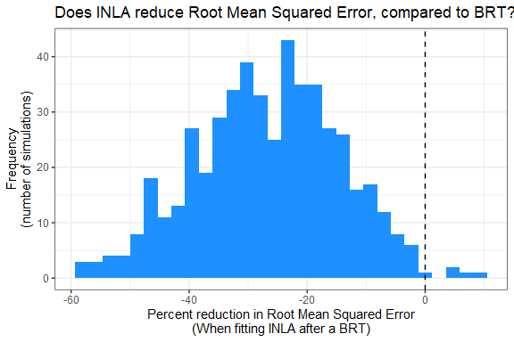

# Motivation

We want to test if Machine Learning methods and Bayesian models can be
used in combination to produce better estimates of species
distributions. Our approach is to:

1.  Fit Boosted Regression Trees (BRTs) to a dataset, which identify the
    most important covariates for predicting species distributions, then

2.  Use the most important covariates in a Bayesian species distribution
    model that allows us to propagage uncertainty, and simultaneously
    accounts for spatial autocorrelation, random effects, and
    informative priors.

This approach may be an efficient way to “let the data speak for itself”
in identifying the most important covariates through machine learning,
after which we can use Bayesian models to properly account for spatial
autocorrelation and error propagation. On the other hand, this may be a
form of “double-dipping” from the data that will lead to over-fit models
that reduce performance.

We therefore conducted simulations to evaluate if this is a reasonable
approach for modeling.

# Background

Boosted regression tree (BRT) approaches, and machine learning more
generally, are extremely good at identifying important covariates for
predicting species distributions. They naturally accommodate complex,
non-linear, and interacting response functions among multiple
covariates, and do not suffer from problems with variable collinearity.

However, BRTs cannot include spatial covariation (when the response
variable at a location is similar to the response variable at nearby
locations, after accounting for covariates). Additionally, BRTs are not
well-suited to the inclusion of random effects (e.g., repeated-measures
data), and cannot include integrated models (e.g., where multiple
response variables with different error distributions are affected by a
shared process). It can also be difficult to properly propagate
uncertainty with BRTs, which is critical for species status and trend
assessments.

In contrast, Bayesian models are excellent for describing and
propagating multiple sources of uncertainty. They can also account for
spatial autocorrelation, and can include ‘informative priors’ to help
improve model outputs. However, Bayesian models typically cannot
accommodate large numbers of covariates, and can suffer from lack of
parameter identifiability when multiple covariates are correlated with
each other.

# Methods

We used simulations to examine whether a two-stage approach to fitting
models improves species distribution estimates, compared to just fitting
a BRT.

## Simulation example

Since almost all habitat and environmental covariates are spatially
autocorrelated, we simulated 25 spatially autocorrelated random
variables, each with different properties. Some covariates are very
noisy, some are smooth, some are highly spatially autocorrelated, and
others have little spatial autocorrelation.

The plots below illustrate each of the covariates.


In our simulations, we allow the first 10 covariates to influence the
species distribution. We draw a random ‘effect size coefficient’ for
each variable, then create the species distribution by multiplying each
spatial covariate by its effect size, and adding them together. The
resulting species distribution is shown below:


We then simulate a survey of the species across the landscape. We assume
there were 500 surveys conducted. At each survey location, the response
variable is recorded, along with covariate information.

*However*, we assume that the surveyor does not record the first 3
covariates. Thus, there are several spatially autocorrelated covariates
that are affecting the species distribution but which cannot be (or have
not been) measured. Below, we illustrate the survey locations across the
landscape, and the table shows the first several rows of data available
for analysis:


    #>   Lat Lon          y       Cov_4      Cov_5      Cov_6      Cov_7      Cov_8
    #> 1  62  72  1.3914339  0.81010128  0.7386873 -0.3066029 -0.2535598  0.4117955
    #> 2  33  57  1.7151235  0.08220344 -0.6192288 -1.0840808 -0.6780876 -1.2226831
    #> 3  44  98  1.9749493  1.81376192  0.5850906  2.2961929  1.8335735 -1.0284014
    #> 4  50  68  0.3400125 -1.42078637 -0.1326049 -0.3398160 -0.4633162 -1.8403012
    #> 5  17   2 -1.0168406 -1.43987863  0.7614564 -0.2136846  1.6278322 -0.1085523
    #> 6  83  98  1.2875867 -0.21173539 -2.1955518  0.4578721  0.5435417  0.6364130
    #>        Cov_9      Cov_10      Cov_11      Cov_12     Cov_13     Cov_14
    #> 1  0.2376177 -0.07301695  0.29326317  1.02192792  0.2722260 -0.8283636
    #> 2  1.0678023  1.62105531 -0.01402708  0.26246402 -2.6884999  0.1572102
    #> 3 -0.5124593  0.30919499 -0.49267541 -1.16056778 -0.2268814 -0.7015717
    #> 4  0.6602822  0.86296969 -0.70565636  0.01489222 -0.8330023 -0.6295054
    #> 5 -1.0217157  0.29136342  0.62312008 -0.60078077  0.3079449 -0.2360091
    #> 6 -0.8023404 -1.39988885  0.84538458 -0.42462486  1.2621419  0.9008485
    #>       Cov_15     Cov_16     Cov_17     Cov_18       Cov_19     Cov_20
    #> 1 -0.3438612 -1.3138575 -0.5418378 -1.2293880  0.125014578  0.1956448
    #> 2 -0.9960344  0.1375602 -0.2413285  2.3924356 -0.462807287 -0.0380100
    #> 3  2.7250213 -1.1281678 -0.4827187 -0.6814205  0.941102796  0.1754420
    #> 4  0.8738830  0.1364842  0.5099690 -1.0557578  0.007870483  1.0130296
    #> 5  0.5382432 -2.3555300  0.3985519  0.9867733  0.476914063 -0.7683059
    #> 6  0.5706273  0.6982979  0.7353109 -0.5285732 -0.112486498 -0.3412642
    #>         Cov_21     Cov_22     Cov_23     Cov_24     Cov_25
    #> 1 -2.125988086  1.5125733 -1.1499365  0.4212438 -0.1327594
    #> 2  0.005249731 -1.0449919 -0.4289436 -2.2351981  1.1498148
    #> 3 -0.710643643  0.5093568  0.9134972  0.1403615  0.3824467
    #> 4  0.517489339  1.4675682 -2.1720922 -0.6716322  0.6253639
    #> 5 -2.233486228 -1.7464987 -1.7077703  0.2946895  0.5589066
    #> 6 -0.601019078 -1.2919081  1.0500630 -0.8359418 -1.0546246

We first analyze the dataset with boosted regression trees, using the
following code. We also plot variable importance.

``` r

# ---------------------------------------
# Fit BRT and generate landscape predictions
# ---------------------------------------

brt <- gbm.step(data=dat, gbm.x = 4:ncol(dat), gbm.y = 3,
                family = "gaussian", tree.complexity = 5,
                learning.rate = 0.01, bag.fraction = 0.5,
                verbose = FALSE,
                plot.main = FALSE)

# generate predictions from brt across landscape
pred_brt <- predict(brt, simdat,n.trees=brt$gbm.call$best.trees, type="response")

# variable importance
var_imp <- summary(brt)
```


The top 5 most important variables (in this case Cov_4, Cov_8, Cov_6,
Cov_10, Cov_13) were then included in a Bayesian species distribution
model, fit using the `inlabru` package in R.

The model includes a spatially autocorreled random field to account for
spatial autocorrelation that is not attributable to the measured
covariates.

``` r

# ---------------------------------------
# Fit model using INLA
# ---------------------------------------

# USE TOP 5 MOST IMPORTANT VARIABLES FROM BRT
top_vars <- var_imp$var[1:5]

# covert data to spatial object
simdat_sf <- st_as_sf(simdat, coords = c("Lon","Lat"),remove = FALSE)
dat_sf <- st_as_sf(dat, coords = c("Lon","Lat"),remove = FALSE)

# make a two extension hulls and mesh for spatial model
hull <- fm_extensions(simdat_sf)

# Spatial mesh
mesh_spatial <- fm_mesh_2d_inla(
  boundary = hull, 
  max.edge = c(5, 10),
  cutoff = 2
)

# Controls the 'residual spatial field'.  This can be adjusted to create smoother surfaces.
prior_range <- c(1, 0.1)   # 10% chance range is smaller than 1
prior_sigma <- c(1,0.1)    # 10% chance sd is larger than 1
matern_coarse <- inla.spde2.pcmatern(mesh_spatial,
                                     prior.range = prior_range, 
                                     prior.sigma = prior_sigma
)

# How much shrinkage should be applied to covariate effects?
sd_linear <- 0.1  
prec_linear <-  c(1/sd_linear^2,1/(sd_linear/2)^2)

# Model formula
model_components = as.formula(paste0('~
            Intercept(1)+
            spde_coarse(main = geometry, model = matern_coarse)+',
            paste0("Beta1_",top_vars,'(1,model="linear", mean.linear = 0, prec.linear = ', prec_linear[1],')', collapse = " + ")))

model_formula= as.formula(paste0('y ~
                  Intercept +
                  spde_coarse +',
                  paste0("Beta1_",top_vars,'*',top_vars, collapse = " + ")))

fit_INLA <- NULL
while(is.null(fit_INLA)){
  
  fit_model <- function(){
    tryCatch(expr = {bru(components = model_components,
                         like(family = "gaussian",
                              formula = model_formula,
                              data = dat_sf),
                         
                         options = list(control.compute = list(waic = FALSE, cpo = FALSE),
                                        bru_verbose = 4))},
             error = function(e){NULL})
  }
  fit_INLA <- fit_model()
  
  if ("try-error" %in% class(fit_INLA)) fit_INLA <- NULL
}

# Prediction
pred_formula = as.formula(paste0(' ~
                  Intercept +
                  spde_coarse +',paste0("Beta1_",top_vars,'*',top_vars, collapse = " + ")))

pred_inla <- generate(fit_INLA,
                      simdat_sf,
                      formula =  pred_formula,
                      n.samples = 1000)

# Predicted response for every pixel on the landscape
pred_inla <- apply(pred_inla,1,mean)
```

Below, we compare the ‘true’ response surface (y) with the predicted
response surfaces estimated from either Boosted Regression Trees (BRTs)
or with the Bayesian model (INLA).


To evaluate which prediction surface is a better representation of the
‘true’ response surface on the left, we calculate two metrics: 1) the
root mean squared error between the prediction and the true surface, and
2) the correlation between the prediction surface and the true surface.

``` r
RMSE_brt <- sqrt(mean((simdat$pred_brt - simdat$y)^2))
RMSE_inla <- sqrt(mean((simdat$pred_inla - simdat$y)^2))
cor_brt <- cor(simdat$pred_brt,simdat$y)
cor_inla <- cor(simdat$pred_inla,simdat$y)
```

The RMSE for the BRT surface is 0.7, while the RMSE for the INLA surface
is 0.44. Thus, in this simulation, the RMSE from the Bayesian model was
37.46% lower than the model fit using BRT.

Additionally, the correlation between the true surface and the
prediction from BRT was 0.92. The correlation for the Bayesian model
prediction was 0.97.

These results (as well as visual inspection of the surfaces above)
illustrate that the Bayesian model resulted in much better predictions
of the species distribution than the boosted regression tree.

## Repeated simulations

Since the result above might have been weird and/or unrepresentative, we
need to re-run the simulation many times to see how consistently a
Bayesian model improves the model fit.

We conducted 150 simulations. For each simulation, we stored the Root
Mean Squared Error and correlation between model predictions and the
‘true’ response surface (y).

Results are illustrated below.



The Bayesian model resulted in lower RMSE for 97% of simulations.

Additionally, predictions from the Bayesian model had a higher
correlation with the true response surface in 97% of simulations.

# Conclusions

This analysis suggests that a Bayesian spatial model outperforms a
machine learning model for predicting spatial response surfaces.

In this case, we used the machine learning model to identify the best
covariates to consider including in the Bayesian model. Then, we used
the Bayesian model to capture residual spatial autocorrelation in the
response surface, beyond that which is explained by explicit covariates.

This approach holds promise for improving species distribution
estimates.
