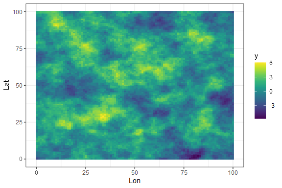
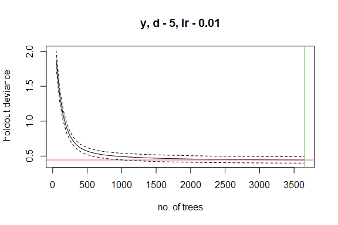
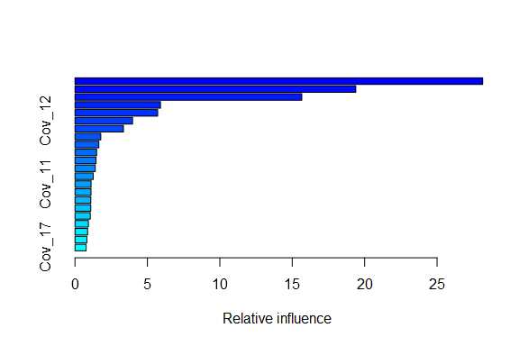

# Motivation

We want to test if Machine Learning methods and Bayesian models can be
used in combination to produce better estimates of species
distributions. Our approach is to:

1.  Fit Boosted Regression Trees (BRTs) to a dataset, which identify the
    most important covariates for predicting species distributions, then

2.  Use the most important covariates in a Bayesian species distribution
    model that allows us to propagage uncertainty, and simultaneously
    accounts for spatial autocorrelation, random effects, and
    informative priors.

This approach may be an efficient way to “let the data speak for itself”
in identifying the most important covariates through machine learning,
after which we can use Bayesian models to properly account for spatial
autocorrelation and error propagation.

Our main concern is whether this is a form of “double-dipping” from the
data that will lead to over-fit models that reduce performance.

# Background

Boosted regression tree (BRT) approaches, and machine learning more
generally, are extremely good at identifying important covariates for
predicting species distributions. They naturally accommodate complex,
non-linear, and interacting response functions among multiple
covariates, and do not suffer from problems with variable collinearity.

However, BRTs cannot include spatial covariation (when the response
variable at a location is similar to the response variable at nearby
locations, after accounting for covariates). Additionally, BRTs are not
well-suited to the inclusion of random effects (e.g., repeated-measures
data), and cannot include integrated models (e.g., where multiple
response variables with different error distributions are affected by a
shared process). It can also be difficult to properly propagate
uncertainty with BRTs, which is critical for species status and trend
assessments.

In contrast, Bayesian models are excellent for describing and
propagating multiple sources of uncertainty. They can also account for
spatial autocorrelation, and can include ‘informative priors’ to help
improve model outputs. However, Bayesian models typically cannot
accommodate large numbers of covariates, and can suffer from lack of
parameter identifiability when multiple covariates are correlated with
each other.

# Methods

We used simulations to examine whether a two-stage approach to fitting
models (BRTs to identify covariates, followed by a Bayesian model to
properly account for uncertainty) improves species distribution
estimates, compared to just fitting a BRT.

## Simulation example

``` r

# ----------------------------------------
# Simulate landscape with 25 spatially autocorrelated covariates
# ----------------------------------------
  
  n_var <- 25
  simdat <- expand.grid(Lat = seq(0,100), Lon = seq(0,100))
  
  for (i in 1:n_var){
    grid <- list(x = seq(0,100), y = seq(0,100))
    obj1 <- matern.image.cov(grid=grid, aRange = runif(1,1,10) , smoothness = runif(1,0.5,1), setup=TRUE)
    simcov <- sim.rf(obj1) %>% reshape2::melt()
    simdat <- cbind(simdat,simcov$value)
  }
  
  colnames(simdat)[3:ncol(simdat)] <- paste0("Cov_",1:n_var)
  
  # ----------------------------------------
  # Simulate response variable, which depends on first 10 covariates
  # ----------------------------------------
  
  # Covariate effects
  coefs <- rep(0,n_var)
  coefs[1:10] <- runif(10,-1,1) # Beta coefficients for first 10 covariates
  coefs <- matrix(coefs,ncol=1)
  
  # Response variable
  y <- as.matrix(simdat[,3:ncol(simdat)]) %*% coefs
  
  simdat <- simdat %>% mutate(y = y) %>% relocate(Lat,Lon,y)
  
  # Map of response variable
  ggplot(simdat)+
    geom_raster(aes(x = Lon, y = Lat, fill = y))+
    scale_fill_gradientn(colors = viridis(10))+
    theme_bw()
```



``` r
  
  # Assume we cannot measure three covariates (drop them from dataframe)
  simdat <- simdat %>% dplyr::select(-Cov_1,-Cov_2,-Cov_3)
  
  # ----------------------------------------
  # Select 500 survey locations
  # ----------------------------------------
  
  n_survey <- 500
  
  dat <- sample_n(simdat, n_survey, replace = TRUE)
  
  # Add observation error
  dat$y <- dat$y + rnorm(nrow(dat),0,0.1)
  
  ggplot(simdat)+
    geom_raster(aes(x = Lon, y = Lat, fill = y))+
    scale_fill_gradientn(colors = viridis(10))+
    geom_jitter(data = dat, aes(x = Lon, y = Lat))+
    theme_bw()
```


``` r
  
  # ---------------------------------------
  # Fit BRT and generate landscape predictions
  # ---------------------------------------
  
  brt <- gbm.step(data=dat, gbm.x = 4:ncol(dat), gbm.y = 3,
                  family = "gaussian", tree.complexity = 5,
                  learning.rate = 0.01, bag.fraction = 0.5)
#> 
#>  
#>  GBM STEP - version 2.9 
#>  
#> Performing cross-validation optimisation of a boosted regression tree model 
#> for y and using a family of gaussian 
#> Using 500 observations and 22 predictors 
#> creating 10 initial models of 50 trees 
#> 
#>  folds are unstratified 
#> total mean deviance =  2.8042 
#> tolerance is fixed at  0.0028 
#> ntrees resid. dev. 
#> 50    1.891 
#> now adding trees... 
#> 100   1.3889 
#> 150   1.0924 
#> 200   0.9092 
#> 250   0.791 
#> 300   0.7117 
#> 350   0.6566 
#> 400   0.617 
#> 450   0.5912 
#> 500   0.5711 
#> 550   0.5545 
#> 600   0.5425 
#> 650   0.5322 
#> 700   0.5234 
#> 750   0.5165 
#> 800   0.5108 
#> 850   0.5056 
#> 900   0.5004 
#> 950   0.496 
#> 1000   0.4936 
#> 1050   0.4902 
#> 1100   0.4869 
#> 1150   0.4845 
#> 1200   0.4822 
#> 1250   0.4801 
#> 1300   0.4776 
#> 1350   0.4755 
#> 1400   0.4735 
#> 1450   0.4722 
#> 1500   0.4698 
#> 1550   0.469 
#> 1600   0.4671 
#> 1650   0.4658 
#> 1700   0.4646 
#> 1750   0.4637 
#> 1800   0.4634 
#> 1850   0.4619 
#> 1900   0.4605 
#> 1950   0.4595 
#> 2000   0.4585 
#> 2050   0.4578 
#> 2100   0.4569 
#> 2150   0.4566 
#> 2200   0.4554 
#> 2250   0.4543 
#> 2300   0.4537 
#> 2350   0.4534 
#> 2400   0.4531 
#> 2450   0.4524 
#> 2500   0.4519 
#> 2550   0.4516 
#> 2600   0.4509 
#> 2650   0.4507 
#> 2700   0.4502 
#> 2750   0.4496 
#> 2800   0.4491 
#> 2850   0.4491 
#> 2900   0.4484 
#> 2950   0.4482 
#> 3000   0.4477 
#> 3050   0.4474 
#> 3100   0.4469 
#> 3150   0.4468 
#> 3200   0.4466 
#> 3250   0.4461 
#> 3300   0.4457 
#> 3350   0.4453 
#> 3400   0.4454 
#> 3450   0.4453 
#> 3500   0.4452 
#> 3550   0.445 
#> 3600   0.4448 
#> 3650   0.4445
```



    #> 
    #> mean total deviance = 2.804 
    #> mean residual deviance = 0.012 
    #>  
    #> estimated cv deviance = 0.444 ; se = 0.045 
    #>  
    #> training data correlation = 0.998 
    #> cv correlation =  0.919 ; se = 0.011 
    #>  
    #> elapsed time -  0.32 minutes
      
      # predictions from brt across landscape
      pred_brt <- predict(brt, simdat,n.trees=brt$gbm.call$best.trees, type="response")
      
      # variable importance
      var_imp <- summary(brt)



``` r
  
  # ---------------------------------------
  # Fit model using INLA
  # ---------------------------------------
  
  # USE TOP 5 MOST IMPORTANT VARIABLES FROM BRT
  top_vars <- var_imp$var[1:5]
  
  # covert data to spatial object
  simdat_sf <- st_as_sf(simdat, coords = c("Lon","Lat"),remove = FALSE)
  dat_sf <- st_as_sf(dat, coords = c("Lon","Lat"),remove = FALSE)
  
  # make a two extension hulls and mesh for spatial model
  hull <- fm_extensions(
    simdat_sf
  )
  
  # Spatial mesh
  mesh_spatial <- fm_mesh_2d_inla(
    boundary = hull, 
    max.edge = c(5, 10),
    cutoff = 2
  )
  
  # Controls the 'residual spatial field'.  This can be adjusted to create smoother surfaces.
  prior_range <- c(1, 0.1)   # 10% chance range is smaller than 1
  prior_sigma <- c(1,0.1)    # 10% chance sd is larger than 1
  matern_coarse <- inla.spde2.pcmatern(mesh_spatial,
                                       prior.range = prior_range, 
                                       prior.sigma = prior_sigma
  )
  
  # How much shrinkage should be applied to covariate effects?
  sd_linear <- 0.1  
  prec_linear <-  c(1/sd_linear^2,1/(sd_linear/2)^2)
  
  # Model formula
  model_components = as.formula(paste0('~
            Intercept(1)+
            spde_coarse(main = geometry, model = matern_coarse)+',
            paste0("Beta1_",top_vars,'(1,model="linear", mean.linear = 0, prec.linear = ', prec_linear[1],')', collapse = " + ")))
  
  model_formula= as.formula(paste0('y ~
                  Intercept +
                  spde_coarse +',
                  paste0("Beta1_",top_vars,'*',top_vars, collapse = " + ")))
  
  fit_INLA <- NULL
  while(is.null(fit_INLA)){
    
    fit_model <- function(){
      tryCatch(expr = {bru(components = model_components,
                           like(family = "gaussian",
                                formula = model_formula,
                                data = dat_sf),
                           
                           options = list(control.compute = list(waic = FALSE, cpo = FALSE),
                                          bru_verbose = 4))},
               error = function(e){NULL})
    }
    fit_INLA <- fit_model()
    
    if ("try-error" %in% class(fit_INLA)) fit_INLA <- NULL
  }
  
  # Prediction
  pred_formula = as.formula(paste0(' ~
                  Intercept +
                  spde_coarse +',paste0("Beta1_",top_vars,'*',top_vars, collapse = " + ")))
  
  # Note that predictions are initially on log scale
  pred_inla <- generate(fit_INLA,
                        simdat_sf,
                        formula =  pred_formula,
                        n.samples = 1000)
  
  pred_mean_inla <- apply(pred_inla,2,mean)
  
  pred_inla <- apply(pred_inla,1,mean)
  
  
```

``` r
results <- data.frame()

for (rep in 1:150){
  
  # Load if file already exists
  if (file.exists("output/results.RDS")) results <- readRDS("output/results.RDS")
  
  if (nrow(results)>=150) break
  
  # ----------------------------------------
  # Simulate landscape with 25 spatially autocorrelated covariates
  # ----------------------------------------
  
  n_var <- 25
  simdat <- expand.grid(Lat = seq(0,100), Lon = seq(0,100))
  
  for (i in 1:n_var){
    grid <- list(x = seq(0,100), y = seq(0,100))
    obj1 <- matern.image.cov(grid=grid, aRange = runif(1,1,10) , smoothness = runif(1,0.5,1), setup=TRUE)
    simcov <- sim.rf(obj1) %>% reshape2::melt()
    simdat <- cbind(simdat,simcov$value)
  }
  
  colnames(simdat)[3:ncol(simdat)] <- paste0("Cov_",1:n_var)
  
  # ----------------------------------------
  # Simulate response variable, which depends on first 10 covariates
  # ----------------------------------------
  
  # Covariate effects
  coefs <- rep(0,n_var)
  coefs[1:10] <- runif(10,-1,1) # Beta coefficients for first 10 covariates
  coefs <- matrix(coefs,ncol=1)
  
  # Response variable
  y <- as.matrix(simdat[,3:ncol(simdat)]) %*% coefs
  
  simdat <- simdat %>% mutate(y = y) %>% relocate(Lat,Lon,y)
  
  # Map of response variable
  ggplot(simdat)+
    geom_raster(aes(x = Lon, y = Lat, fill = y))+
    scale_fill_gradientn(colors = viridis(10))+
    theme_bw()
  
  # Assume we cannot measure three covariates (drop them from dataframe)
  simdat <- simdat %>% dplyr::select(-Cov_1,-Cov_2,-Cov_3)
  
  # ----------------------------------------
  # Select 500 survey locations
  # ----------------------------------------
  
  n_survey <- 500
  
  dat <- sample_n(simdat, n_survey, replace = TRUE)
  
  # Add observation error
  dat$y <- dat$y + rnorm(nrow(dat),0,0.1)
  
  ggplot(simdat)+
    geom_raster(aes(x = Lon, y = Lat, fill = y))+
    scale_fill_gradientn(colors = viridis(10))+
    geom_jitter(data = dat, aes(x = Lon, y = Lat))+
    theme_bw()
  
  # ---------------------------------------
  # Fit BRT and generate landscape predictions
  # ---------------------------------------
  
  brt <- gbm.step(data=dat, gbm.x = 4:ncol(dat), gbm.y = 3,
                  family = "gaussian", tree.complexity = 5,
                  learning.rate = 0.01, bag.fraction = 0.5)
  
  # predictions from brt across landscape
  pred_brt <- predict(brt, simdat,n.trees=brt$gbm.call$best.trees, type="response")
  
  # variable importance
  var_imp <- summary(brt)
  
  # ---------------------------------------
  # Fit model using INLA
  # ---------------------------------------
  
  # USE TOP 5 MOST IMPORTANT VARIABLES FROM BRT
  top_vars <- var_imp$var[1:5]
  
  # covert data to spatial object
  simdat_sf <- st_as_sf(simdat, coords = c("Lon","Lat"),remove = FALSE)
  dat_sf <- st_as_sf(dat, coords = c("Lon","Lat"),remove = FALSE)
  
  # make a two extension hulls and mesh for spatial model
  hull <- fm_extensions(
    simdat_sf
  )
  
  # Spatial mesh
  mesh_spatial <- fm_mesh_2d_inla(
    boundary = hull, 
    max.edge = c(5, 10),
    cutoff = 2
  )
  
  # Controls the 'residual spatial field'.  This can be adjusted to create smoother surfaces.
  prior_range <- c(1, 0.1)   # 10% chance range is smaller than 1
  prior_sigma <- c(1,0.1)    # 10% chance sd is larger than 1
  matern_coarse <- inla.spde2.pcmatern(mesh_spatial,
                                       prior.range = prior_range, 
                                       prior.sigma = prior_sigma
  )
  
  # How much shrinkage should be applied to covariate effects?
  sd_linear <- 0.1  
  prec_linear <-  c(1/sd_linear^2,1/(sd_linear/2)^2)
  
  # Model formula
  model_components = as.formula(paste0('~
            Intercept(1)+
            spde_coarse(main = geometry, model = matern_coarse)+',
            paste0("Beta1_",top_vars,'(1,model="linear", mean.linear = 0, prec.linear = ', prec_linear[1],')', collapse = " + ")))
  
  model_formula= as.formula(paste0('y ~
                  Intercept +
                  spde_coarse +',
                  paste0("Beta1_",top_vars,'*',top_vars, collapse = " + ")))
  
  fit_INLA <- NULL
  while(is.null(fit_INLA)){
    
    fit_model <- function(){
      tryCatch(expr = {bru(components = model_components,
                           like(family = "gaussian",
                                formula = model_formula,
                                data = dat_sf),
                           
                           options = list(control.compute = list(waic = FALSE, cpo = FALSE),
                                          bru_verbose = 4))},
               error = function(e){NULL})
    }
    fit_INLA <- fit_model()
    
    if ("try-error" %in% class(fit_INLA)) fit_INLA <- NULL
  }
  
  # Prediction
  pred_formula = as.formula(paste0(' ~
                  Intercept +
                  spde_coarse +',paste0("Beta1_",top_vars,'*',top_vars, collapse = " + ")))
  
  # Note that predictions are initially on log scale
  pred_inla <- generate(fit_INLA,
                        simdat_sf,
                        formula =  pred_formula,
                        n.samples = 1000)
  
  pred_mean_inla <- apply(pred_inla,2,mean)
  
  pred_inla <- apply(pred_inla,1,mean)
  
  # ---------------------------------------
  # Evaluate quality of model fits; save in results dataframe
  # ---------------------------------------
  
  RMSE_brt <- sqrt(mean((pred_brt - simdat$y)^2))
  RMSE_inla <- sqrt(mean((pred_inla - simdat$y)^2))
  
  results <- rbind(results,data.frame(RMSE_brt = RMSE_brt,
                                      RMSE_inla = RMSE_inla,
                                      cor_brt = cor(pred_brt,simdat$y),
                                      cor_inla = cor(pred_inla,simdat$y)
  ))
  
  # Save results
  saveRDS(results,"output/results.RDS")
  
}

# ---------------------------------------
# Load results
# ---------------------------------------

results <- readRDS("output/results.RDS")

# ---------------------------------------
# Summarize results; Are GLM predictions better than BRTs?
# ---------------------------------------
results$simulation_number <- 1:nrow(results)

# How much does GAM reduce RMSE?
results$percent_reduction_RMSE <- 100*(results$RMSE_inla - results$RMSE_brt)/results$RMSE_brt
  
RMSE_plot <- ggplot(data = results, aes(x = percent_reduction_RMSE))+
  geom_histogram(fill = "dodgerblue")+
  geom_vline(xintercept = 0, linetype = 2)+
  ylab("Frequency\n(number of simulations)")+
  xlab("Percent reduction in Root Mean Squared Error\n(When fitting INLA after a BRT)")+
  ggtitle("Does INLA reduce Root Mean Squared Error, compared to BRT?")+
  theme_bw()
RMSE_plot
```


``` r

cor_plot <- ggplot(data = results, aes(x = cor_inla - cor_brt))+
  geom_histogram(fill = "dodgerblue")+
  geom_vline(xintercept = 0, linetype = 2)+
  ylab("Frequency\n(number of simulations)")+
  xlab("Improvement in Correlation\n(When fitting INLA after a BRT)")+
  ggtitle("Does INLA improve correlation with 'true' density, compared to BRT?")+
  theme_bw()
cor_plot
```


``` r

# Percent of simulations where INLA resulted in a lower RMSE:
mean(results$RMSE_inla < results$RMSE_brt) # 0.97
#> [1] 0.9733333

# Percent of simulations where INLA resulted in a higher correlation:
mean(results$cor_inla > results$cor_brt) # 0.97
#> [1] 0.9733333
```
