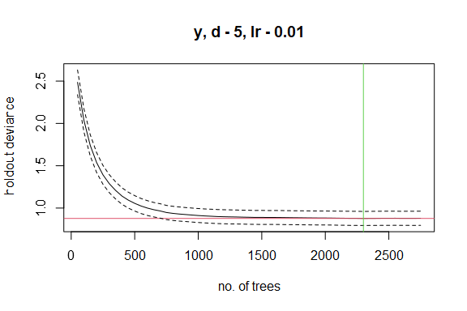

# Motivation

We want to test if Machine Learning methods and Bayesian models can be
used in combination to produce better estimates of species
distributions. Our approach is to:

1.  Fit Boosted Regression Trees (BRTs) to a dataset, which identify the
    most important covariates for predicting species distributions, then

2.  Use the most important covariates in a Bayesian species distribution
    model that allows us to propagage uncertainty, and simultaneously
    accounts for spatial autocorrelation, random effects, and
    informative priors.

This approach may be an efficient way to “let the data speak for itself”
in identifying the most important covariates through machine learning,
after which we can use Bayesian models to properly account for spatial
autocorrelation and error propagation.

Our main concern is whether this is a form of “double-dipping” from the
data that will lead to over-fit models that reduce performance.

# Background

Boosted regression tree (BRT) approaches, and machine learning more
generally, are extremely good at identifying important covariates for
predicting species distributions. They naturally accommodate complex,
non-linear, and interacting response functions among multiple
covariates, and do not suffer from problems with variable collinearity.

However, BRTs cannot include spatial covariation (when the response
variable at a location is similar to the response variable at nearby
locations, after accounting for covariates). Additionally, BRTs are not
well-suited to the inclusion of random effects (e.g., repeated-measures
data), and cannot include integrated models (e.g., where multiple
response variables with different error distributions are affected by a
shared process). It can also be difficult to properly propagate
uncertainty with BRTs, which is critical for species status and trend
assessments.

In contrast, Bayesian models are excellent for describing and
propagating multiple sources of uncertainty. They can also account for
spatial autocorrelation, and can include ‘informative priors’ to help
improve model outputs. However, Bayesian models typically cannot
accommodate large numbers of covariates, and can suffer from lack of
parameter identifiability when multiple covariates are correlated with
each other.

# Methods

We used simulations to examine whether a two-stage approach to fitting
models improves species distribution estimates, compared to just fitting
a BRT.

## Simulation example

Since almost all habitat and environmental covariates are spatially
autocorrelated, we simulated 25 spatially autocorrelated random
variables, each with different properties. Some covariates are very
noisy, some are smooth, some are highly spatially autocorrelated, and
others have little spatial autocorrelation.

The plots below illustrate each of the covariates.

In our simulations, we allow the first 10 covariates to influence the
species distribution. We draw a random ‘effect size coefficient’ for
each variable, then create the species distribution by multiplying each
spatial covariate by its effect size, and adding them together. The
resulting species distribution is shown below:

We then simulate a survey of the species across the landscape. We assume
there were 500 surveys conducted. At each survey location, the response
variable is recorded, along with covariate information.

*However*, we assume that the surveyor does not record the first 3
covariates. Thus, there are several spatially autocorrelated covariates
that are affecting the species distribution but which cannot be (or have
not been) measured. Below, we illustrate the survey locations across the
landscape, and the table shows the first several rows of data available
for analysis:

    #>   Lat Lon          y       Cov_4        Cov_5      Cov_6       Cov_7      Cov_8
    #> 1  61   7 -0.9388965  0.47371046 -2.012667549 -0.2829903 -1.16772021  0.2359831
    #> 2   6   6  0.0880656  0.08786953 -0.779571566  0.1395168 -0.29217859  1.4124288
    #> 3  52   2  1.1803392  1.59067642  0.490070393 -1.0305699 -1.55478000  0.1545154
    #> 4   7  83 -0.4787807 -0.62514224  0.763407851  0.7344660  1.53270413 -0.9027226
    #> 5  42  11  0.9042171 -0.41232338  0.171708931 -0.9473261 -0.03370702 -1.5930700
    #> 6  95  48 -3.0299608 -0.42607442 -0.002415646  1.3466899  0.71450321  0.8968242
    #>        Cov_9      Cov_10     Cov_11     Cov_12     Cov_13      Cov_14
    #> 1  0.9499256  1.82300818  1.5894835 -0.8693502  0.3135130 -0.45294039
    #> 2 -0.5130206  0.46948829 -0.7856515 -1.0559092  1.2190467  0.86498155
    #> 3 -0.1491359  2.23220824 -0.4271634  0.6443190  0.2871630 -0.03919319
    #> 4 -1.8372636 -0.01025496 -0.5114358  0.5753550 -0.6666246  1.41642086
    #> 5 -0.4806327 -0.04208725  2.2028051  0.8751997  0.5978097  0.84376483
    #> 6  0.8647323  0.18479181 -1.3026645  0.2773482 -0.4220347 -0.19650393
    #>       Cov_15      Cov_16     Cov_17     Cov_18      Cov_19     Cov_20
    #> 1  0.7315646  0.07802433 -1.0822567  0.8897636 -1.15119400 -0.3856629
    #> 2  0.5810093 -0.62354090 -1.6611011  1.6371258 -1.12044977 -0.7050954
    #> 3  0.5012458  0.42933319 -0.6853281  0.1493396 -0.74676060  0.5553814
    #> 4 -0.5534754 -0.41033859  0.3011067 -0.3891386 -1.04513602  0.4958546
    #> 5 -2.5225031  1.66733837 -0.9096757 -0.5464115  0.67572515 -0.2636746
    #> 6 -3.1434381 -0.39819112 -0.2348654  0.8877313  0.05202036 -0.7036159
    #>        Cov_21      Cov_22     Cov_23      Cov_24     Cov_25
    #> 1 -2.26643178 -1.74459119  1.2621166 -1.28951118  0.1018613
    #> 2  1.33879946  0.22336397 -1.3954533  0.90879809  1.6518420
    #> 3  0.01207982 -0.09084017  0.6222731 -0.03161778  1.7633580
    #> 4  1.90390100  0.63295170  1.3754519  0.79527414  1.3003943
    #> 5 -0.81048963  1.64976701 -0.9721220 -0.12403955 -0.6672910
    #> 6 -0.42723334 -1.25195958 -0.1063610  0.15618033 -0.7955136

assume the following

    #> 
    #>  
    #>  GBM STEP - version 2.9 
    #>  
    #> Performing cross-validation optimisation of a boosted regression tree model 
    #> for y and using a family of gaussian 
    #> Using 500 observations and 22 predictors 
    #> creating 10 initial models of 50 trees 
    #> 
    #>  folds are unstratified 
    #> total mean deviance =  3.246 
    #> tolerance is fixed at  0.0032 
    #> ntrees resid. dev. 
    #> 50    2.4853 
    #> now adding trees... 
    #> 100   2.0375 
    #> 150   1.74 
    #> 200   1.538 
    #> 250   1.3928 
    #> 300   1.2879 
    #> 350   1.2079 
    #> 400   1.1414 
    #> 450   1.0934 
    #> 500   1.0555 
    #> 550   1.0242 
    #> 600   0.9998 
    #> 650   0.9806 
    #> 700   0.966 
    #> 750   0.9475 
    #> 800   0.9374 
    #> 850   0.9296 
    #> 900   0.9236 
    #> 950   0.9176 
    #> 1000   0.9118 
    #> 1050   0.9072 
    #> 1100   0.9036 
    #> 1150   0.8997 
    #> 1200   0.8975 
    #> 1250   0.8959 
    #> 1300   0.8946 
    #> 1350   0.8926 
    #> 1400   0.8912 
    #> 1450   0.8894 
    #> 1500   0.8896 
    #> 1550   0.889 
    #> 1600   0.8889 
    #> 1650   0.8882 
    #> 1700   0.8871 
    #> 1750   0.8861 
    #> 1800   0.8854 
    #> 1850   0.8843 
    #> 1900   0.8835 
    #> 1950   0.8828 
    #> 2000   0.8825 
    #> 2050   0.8818 
    #> 2100   0.8807 
    #> 2150   0.8798 
    #> 2200   0.8787 
    #> 2250   0.8786 
    #> 2300   0.8773 
    #> 2350   0.8781 
    #> 2400   0.8785 
    #> 2450   0.8794 
    #> 2500   0.8793 
    #> 2550   0.8799 
    #> 2600   0.8787 
    #> 2650   0.8791 
    #> 2700   0.8789 
    #> 2750   0.8795

    #> 
    #> mean total deviance = 3.246 
    #> mean residual deviance = 0.067 
    #>  
    #> estimated cv deviance = 0.877 ; se = 0.083 
    #>  
    #> training data correlation = 0.99 
    #> cv correlation =  0.86 ; se = 0.01 
    #>  
    #> elapsed time -  0.24 minutes

## Repeated simulations

Since the result above might have been a weird and/or unrepresentative
result, we need to re-run the simulation above many times to see how
consistently a Bayesian model improves the model fit.

We conducted 150 simulations. For each simulation, we stored the Root
Mean Squared Error and correlation between model predictions and the
‘true’ (simulated) response surface, y.

Results are illustrated below.

    #> [1] 0.9733333
    #> [1] 0.9733333
